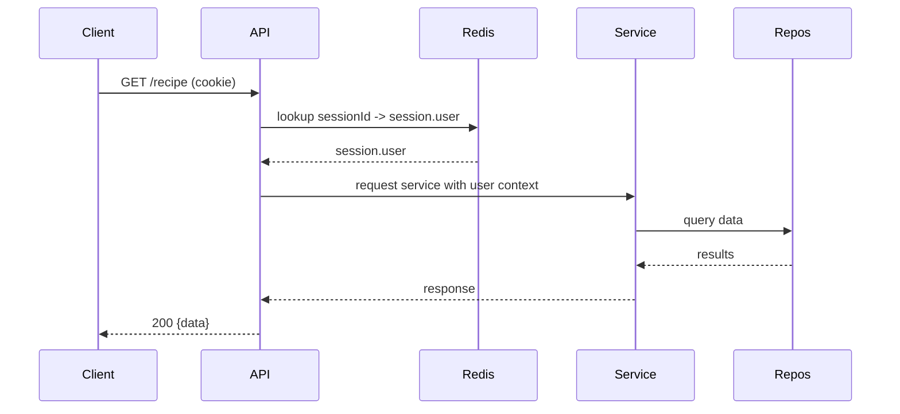

# Architecture Diagrams

This file contains simple Mermaid diagrams to visualise the most important flows and the deployment topology.

## Component Diagram

```mermaid
graph LR
  Client[Client (Browser / Mobile)] -->|HTTPS| API[Chefify API - Express (Bun)]
  API --> Services[Services Layer]
  Services --> Repos[Repositories (Mongoose)]
  Services --> Redis[Redis (Session Store)]
  Services --> Cloudinary[Cloudinary (Media)]
  Services --> OpenAI[OpenAI API]
  Services --> SMTP[SMTP Provider]
  Repos --> Mongo[(MongoDB Atlas)]

  style API fill:#f9f,stroke:#333,stroke-width:1px
  style Redis fill:#ffebcc
  style Mongo fill:#cdeffd
  style Cloudinary fill:#f0f0f0
  style OpenAI fill:#f7e7ff
```

## Sequence: Login and Session Creation

```mermaid
sequenceDiagram
  participant C as Client
  participant API as API (Express)
  participant S as AuthService
  participant R as Redis
  participant M as MongoDB

  C->>API: POST /auth/login (email,password)
  API->>S: validate + authenticate user
  S->>M: find user by email
  M-->>S: user record
  S-->>API: user info
  API->>R: create session key (sessionstore)
  R-->>API: session id
  API-->>C: Set-Cookie: sessionId (HttpOnly, Secure)
  C-->>API: subsequent requests include cookie

  Note over R,API: Sessions persisted in Redis; session contains minimal user info (id, role, email)
```

## Sequence: Protected Request Flow



## Deployment Diagram (simple)

```mermaid
flowchart TB
  subgraph Cloud
    LB[Load Balancer]
    App[App instances (Bun + Express)]
    Redis[Redis - Private Network]
    Mongo[MongoDB Atlas]
    Cloudinary[Cloudinary]
    OpenAI[OpenAI]
  end

  Client --> LB --> App
  App --> Redis
  App --> Mongo
  App --> Cloudinary
  App --> OpenAI

  style Redis fill:#ffebcc
  style Mongo fill:#cdeffd
```

Notes

- Diagrams are intentionally high-level. They should be used as a quick reference; more detailed sequence diagrams can be added per feature.
- Use these diagrams in design discussions and PR descriptions to illustrate architectural changes.
